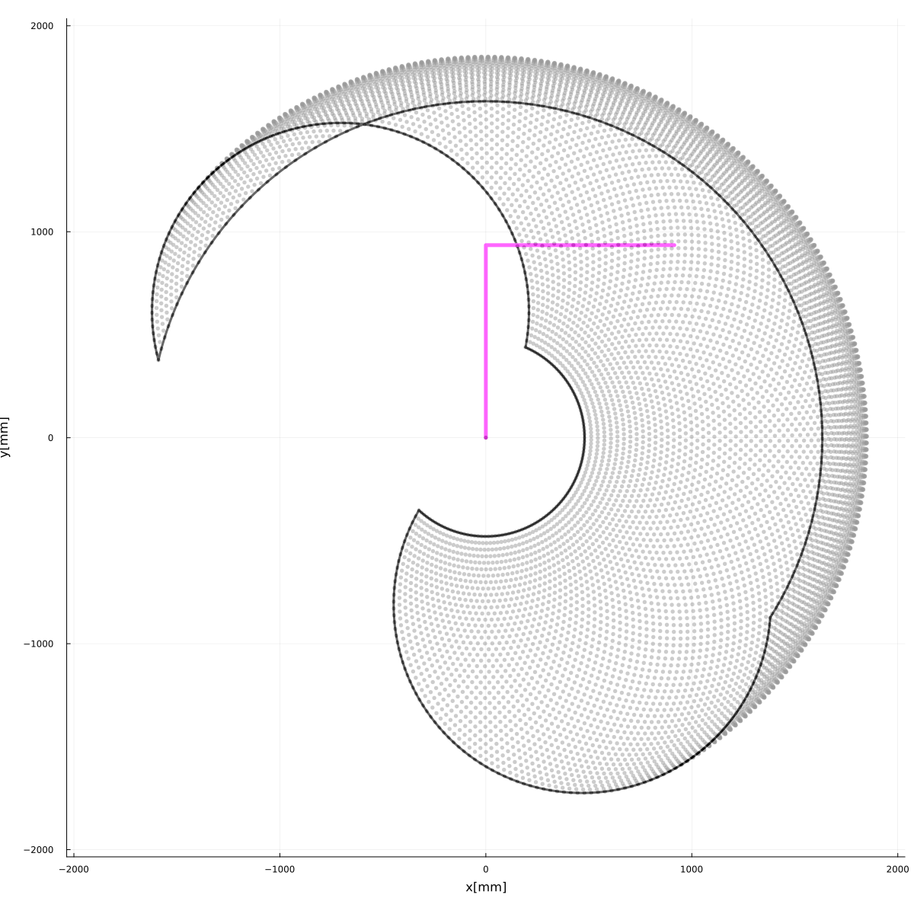

# 2-DOF Manipulator Workspace

_수직다관절로봇 워크스페이스 작도 스크립트_

_Script to draw workspace of articulated manipulator_

## Pre-requisites

* Julia lang with `IJulia`, `Plots`

* Imagemagick

## Howto

* Start `Jupyter notebook` or `Jupyter lab`
* Open `2DOF_Workspace.ipynb`
* Define parameters : `l1`,`l2`, `theta1_min`, `theta1_max`, `theta2_min`, `theta2_max`

* Run every cells
* Check output Images : `2DOF_workspace1.png`, `2DOF_workspace2.png`, `2DOF_workspace3.png`

## Example

